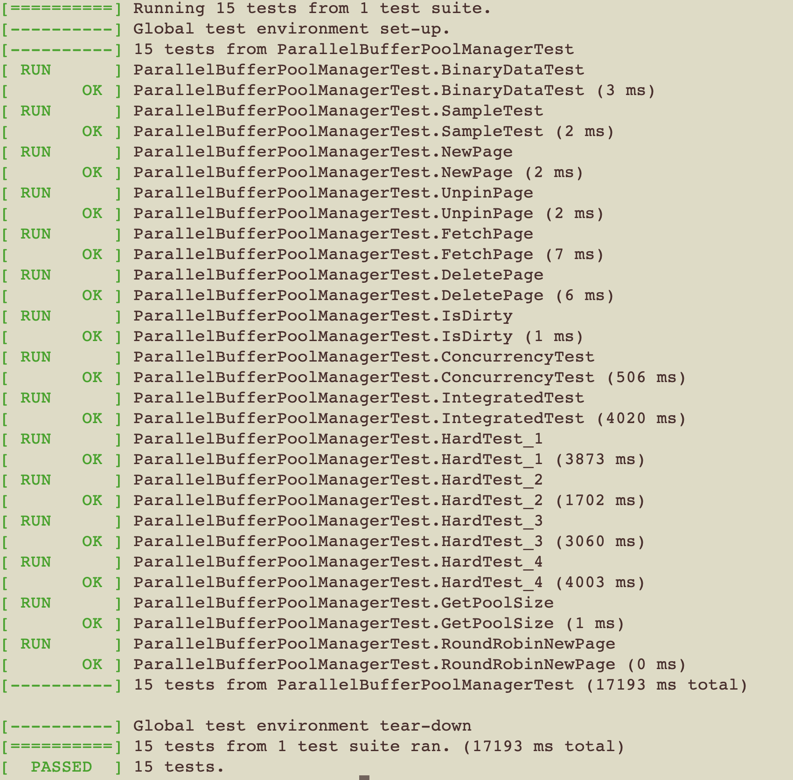

# CMU15-445_Database_Project
 Database Design Project (C++)  
 Course Link:  

 https://15445.courses.cs.cmu.edu/fall2021/assignments.html  

 Project Link:  

 https://github.com/cmu-db/bustub  

## Environment
Mac & Linux_Ubuntu (VMware)

## Tools
CMake, Google C++ Style Guide, Unit Testing, etc  

## Gradescope Test File
Print out the test file to get the whole Gradescope test file!  
    FILE *out;
    out = fopen("/autograder/bustub/test/buffer/grading_buffer_pool_manager_instance_test.cpp", "r");  
    // out = fopen("../test/buffer/buffer_pool_manager_instance_test.cpp", "r");
    char ch;
    while ((ch = getc(out)) != EOF) {
        putchar(ch);
    }
    fclose(out);

Get the path for testing on Gradescope using getcwd().   
    #include < direct.h >;   (Windows)
    #include < unistd.h >;   (Linux/Mac)
    int MAX_PATH = 10000;
    char buffer[ MAX_PATH ];
    std::cout << getcwd(buffer, MAX_PATH);  

## Debug 
"common/logger.h"  
or
codelldb:(to be done)  
On launch.json:  "program": "${workspaceFolder}/build/test/starter_test",  
    {
        // Use IntelliSense to learn about possible attributes.
        // Hover to view descriptions of existing attributes.
        // For more information, visit: https://go.microsoft.com/fwlink/?linkid=830387
        "version": "0.2.0",
        "configurations": [
            {
                "type": "lldb",
                "request": "launch",
                "name": "Debug",
                "program": "${workspaceFolder}/build/test/starter_test",
                "args": [],
                "cwd": "${workspaceFolder}"
    } ]
    }

## Project 0
  

Keypoint used in C++:  
Template -- template < typename T >  
Exception  

How to create m*n arrays [the 2nd way-inherit]  

Google C++ Style Guide  
    Naming_Class Data Members need a trailing underscore.  

    ** no viable conversion from   
    std::unique_ptr<bustub::RowMatrix<int> : temp   
    const RowMatrix<T> * : temp.get()  
    
    Consider replacing 'unsigned long' with 'uint64' uint64_t  
    C-style casts are discouraged; use static_cast/const_cast/reinterpret_cast  
    Convert one int ->int64_t  
    const uint64_t size = (static_cast<uint64_t>(rows_) * cols_)  
    

  

## Project 1
  

Reference: Database-System-Concepts-7th-Edition Ch13.5 Database Buffer  

LRU Replacer  
Need to search in o(1), delete; Perform like a stack  
Data Structure: Hash map + Linked list  

Buffer Pool Manager (BPM) Instance  
Data Structure:  
std::unordered_map< page_id_t, frame_id_t > page_table_;  
std::list< frame_id_t > free_list_;  

Class Pages (including content;page_id_ ;pin_count_ = 0; is_dirty_)  
Class BPM is friend class of Pages  
Class DiskManager(Responsible for writing page from BPM to Disk)  

-> Parallel BPM, which has its own latch / Inheritance  

Print out the test file to get the whole Gradescope test file!  
    /*Gradescope Test output*/  
    
    FILE *out;
    out = fopen("/autograder/bustub/test/buffer/grading_..._test.cpp", "r");  
    // out = fopen("../test/buffer/..._test.cpp", "r");  
    char ch;  
    while ((ch = getc(out)) != EOF) {  
        putchar(ch);  
    }  
    fclose(out);  

Get the path for testing on Gradescope using getcwd().      
    #include < direct.h >;   (Windows)  
    #include < unistd.h >;   (Linux/Mac)  
    int MAX_PATH = 10000;  
    char buffer[MAX_PATH];  
    std::cout << getcwd(buffer, MAX_PATH);    

latch_.lock();  
std::lock_guard< std::mutex > lock(latch_); //better as unlock automatically in Deconstructor  

Avoid calling another function with latch (interlock)  

ConcurrencyTest  
std::vector< std::thread > threads;  
std::shared_ptr< BufferPoolManagerInstance > bpm( )  
threads.push_back(std::thread([ &bpm ]( ){  

Test Failed: False is not true : Test Timed out  
Some part of the code is wrong.(infinite loop , etc)  

==5570==ERROR: AddressSanitizer: heap-use-after-free on address 0x000107101a90 at pc 0x000102bca6d0 bp 0x00016d8325b0 sp 0x00016d8325a8  

    // frame_id = &(victimize_list_.front());  
    *frame_id = victimize_list_.front();  
    
Google C++ Style Guide  
Clang-tidy:  don't use else after return;  

redundant boolean literal supplied to boolean operator x  
    if (replacer_->Victim(&frame_id) == false) {  
        ~~~~~~~~~~~~~~~~~~~~~~~~~~~~~~~~^~~~~  
        !replacer_->Victim(&frame_id)  
 error: use range-based for loop instead  

    for (auto iter = page_table_.begin(); iter != page_table_.end(); ++iter) {  
    ^   ~~~~~~~~~~~~~~~~~~~~~~~~~~~~~~~~~~~~~~~~~~~~~~~~~~~~~~~~~~~~~~~~~~~~  
        (auto & iter : page_table_)  

error: missing username/bug in TODO  
  // TODO:reset its metadata  
  ^~~~~~~~~~~~~~~~~~~~~~~~~~  
  // TODO(unknown): reset its metadata  

